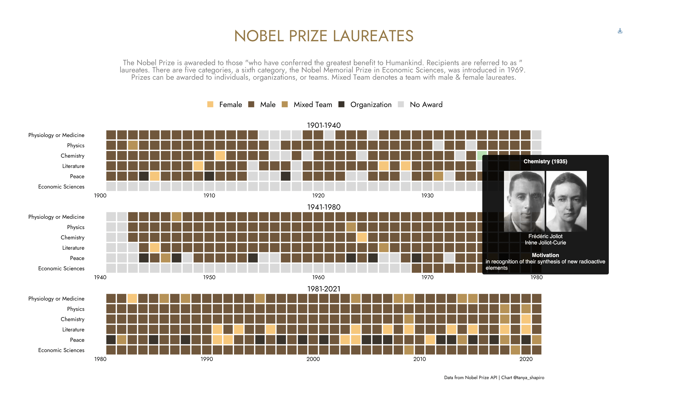

# Nobel Laureates - Category, Year, & Gender

I recently came across a tweet acknowledging Nobel laureates for their achievments. After scrolling through several faces, I noticed the majority were male laureates. This prompted me to take a look at laureates throughout history - how many of them were women? 

From an excerpt on [Wikipedia](https://en.wikipedia.org/wiki/List_of_female_Nobel_laureates): *As of 2021, 59 Nobel Prizes have been awarded to 58 women.[2] Unique Nobel Prize laureates include 885 men, 58 women, and 25 organizations.* That's less than 20% of all Nobel Laureates!

A list of all female laureates can be found [here](https://en.wikipedia.org/wiki/List_of_female_Nobel_laureates).

One of the most noteable female laureates was Marie Curie. She was the first female laureate, in 1903 she wont the Nobel Prize in Physics alongside her husband, Pierre Curie, for their ["joint researches on the radiation phenomena"](https://www.nobelprize.org/prizes/physics/1903/summary/). She later won the Nobel Prize of Chemistry in 1911 for her discovery of radium and polonium. She is the only woman to win the Nobel Prize twice.

### Background
---

Background the Nobel Prize from excerpt on [Wikipedia](https://en.wikipedia.org/wiki/Nobel_Prize):

> Nobel Prizes are awarded in the fields of Physics, Chemistry, Physiology or Medicine, Literature, and Peace (Nobel characterized the Peace Prize as "to the person who has done the most or best to advance fellowship among nations, the abolition or reduction of standing armies, and the establishment and promotion of peace congresses"). In 1968, Sveriges Riksbank (Sweden's central bank) funded the establishment of the Prize in Economic Sciences in Memory of Alfred Nobel, to also be administered by the Nobel Foundation. Nobel Prizes are widely regarded as the most prestigious awards available in their respective fields.

### Data
---
Data for this visualization taken directly from the [Nobel Prize Rest API](https://www.nobelprize.org/about/developer-zone-2/). Data was imported directly into R with jsonlite and httr, and then transformed into a tabular format. 

### Visualization 
--- 

Graphic was created using ggplot and ggtext. The interactive component was added using ggiraph.

Interactive version available [here](https://www.tanyashapiro.com/interactive-visuals/nobel-prize-laureates).

